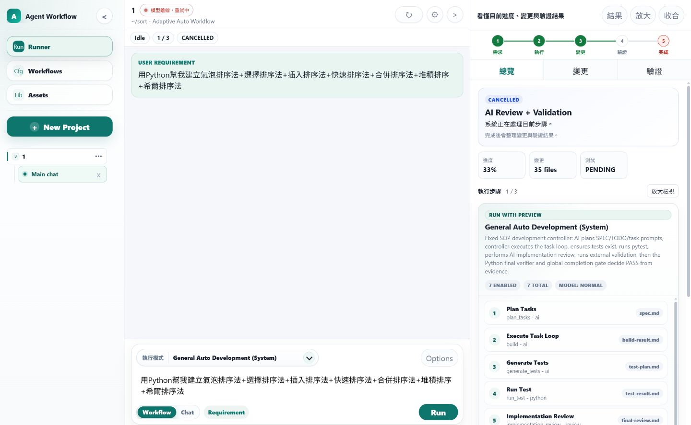
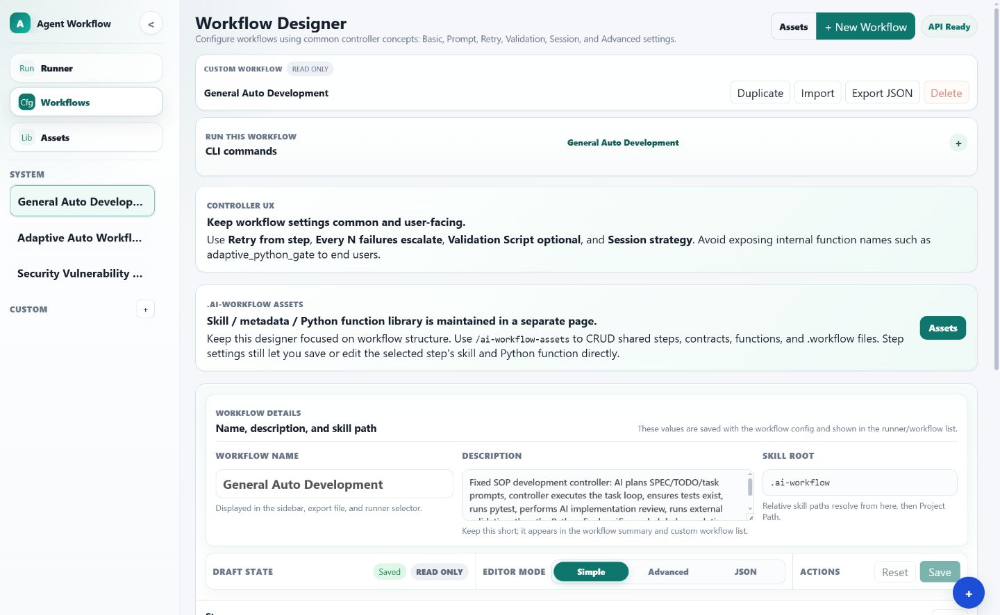
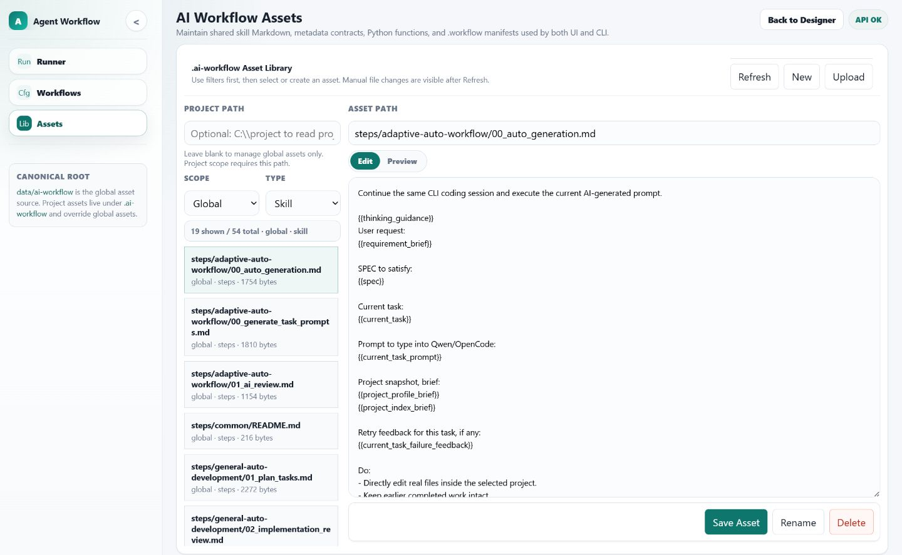

# Local AI Engineering Workflow Platform

A local-first, evidence-driven workflow controller for Qwen Code, OpenCode, and compatible CLI coding agents.

```text
One user request
→ inspect project and establish baseline
→ reuse or verify Project Validation Profile
→ plan task contracts
→ let Qwen/OpenCode edit files from Project Path cwd
→ validate, repair, recover, and retry
→ atomically deliver verified changes
```

## Product principles

- Qwen/OpenCode always runs with the selected **Project Path as cwd**, so project-local configuration is loaded.
- The controller never generates requested source files and never materializes FILE blocks; actual Agent filesystem changes are required.
- Simple Mode is unattended by default and only asks for project, requirement, and Agent/model.
- Different projects/sessions can run concurrently through configurable provider slots; one project keeps one active writer.
- Small models may retry many times. Quantitative progress evidence keeps useful repairs running, while Run/Step/Task/error/time budgets and fresh-session rotation stop useless loops.
- Model endpoints are continuously rechecked through a circuit breaker. Offline unattended runs pause safely, allow one controlled recovery probe, and continue after the model reconnects instead of rapidly consuming retries or processes.
- Every unattended run establishes a baseline, reuses a saved Project Validation Profile, persists restart-safe leases/idempotent attempts, and can use an isolated workspace with restart-idempotent atomic apply and rollback.
- Completion requires real file changes, project-native Build/Test/Lint/Type Check, optional immutable Validation Script, scope checks, and a deterministic Completion Gate.
- Overview stays simple and opens the dedicated Patch Review workbench when human delivery review is needed; raw Agent output, complete logs, Repair Strategy, Execution Artifacts, and system evidence remain in the closable/maximizable diagnostics workspace.

## Built-in workflows

- **General Auto Development** — fixed engineering SOP; recommended for local/small models.
- **Adaptive Auto Workflow** — compact AI-planned task loop for broader work.
- **Security Vulnerability Scan** — read-mostly security inventory and supported scans.

## Quick start

```powershell
python -m venv .venv
.\.venv\Scripts\pip install -r requirements.txt
.\.venv\Scripts\python -m uvicorn app.main:app --reload --port 8000
```

Open `http://127.0.0.1:8000`, run Setup Smoke, select a project, enter one requirement, and start.

## UI tour

The Runner keeps the user request and execution controls visible while the Run Center summarizes Overview and Validation. When collapsed, the right side becomes a narrow status rail instead of a compressed panel. The Overview opens a near-fullscreen Patch Review workbench with a collapsible/resizable file navigator, remembered layout preferences, unified/split views, bounded large-Diff rendering, evidence-bound approval, Partial Patch revalidation, and atomic apply controls. Execution Artifacts use segmented previews and expose storage/archive summaries instead of rendering unlimited content at once.



Workflow Designer provides Simple, Advanced, and JSON modes over the same backend workflow definition.



The Asset Library manages shared or project-local skills, metadata contracts, Python functions, and workflow manifests.



## Documentation

| Language | Entry |
|---|---|
| English | [`doc/en/README.md`](doc/en/README.md) |
| 繁體中文 | [`doc/zh-TW/README.md`](doc/zh-TW/README.md) |

The canonical guides include Simple/Advanced Mode, unattended recovery, reusable Project Validation Profiles, model reconnect, atomic delivery, operations, testing, and a complete Validation Script example.

V22 details are in [`IMPLEMENTATION_REPORT_V22.md`](IMPLEMENTATION_REPORT_V22.md). This release repairs persisted Artifact metadata and previews, restores Step-scoped related-file dialogs, makes Split Diff columns exactly equal, and excludes tool/controller metadata from Patch scope while preserving project-local Qwen/OpenCode configuration in the effective Agent cwd. V21 Patch approval and V20 unattended transaction safety remain intact. OS-level Agent sandboxing is deliberately not included.

## Core checks

```powershell
python -m compileall -q app tests scripts
python scripts/validate_workflow_assets.py
python scripts/run_tests.py --isolate-all --file-timeout 240
python scripts/run_production_acceptance.py
python scripts/run_chaos_matrix.py
python scripts/run_reliability_soak.py --iterations 200
```

Real-agent tests remain opt-in because they require the local CLI and model:

```powershell
python scripts/run_real_agent_matrix.py --mode real --execute --agent qwen --parallel 1
```


Real Qwen unattended cases on the target machine:

```powershell
python scripts/run_real_qwen_unattended_e2e.py
python scripts/run_real_qwen_unattended_e2e.py --parallel
```

These cases are opt-in and are not counted as passed until executed with the target Qwen CLI/model configuration.

The latest local Qwen V19 acceptance run completed all 10 workflow/case cells with 100% success after repair, 100% external-validation pass rate, no manual intervention, and no scope violations. Separate one-line seven-sort projects also completed through both General and Adaptive; their Agent-generated test suites passed 7/7 and 71/71 tests respectively.
